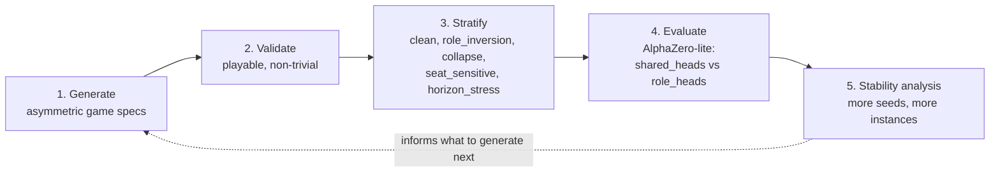
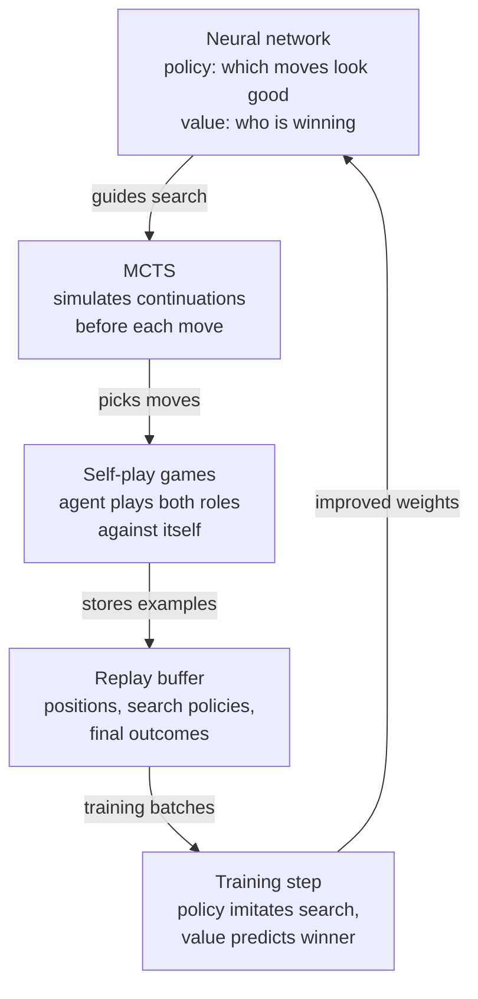
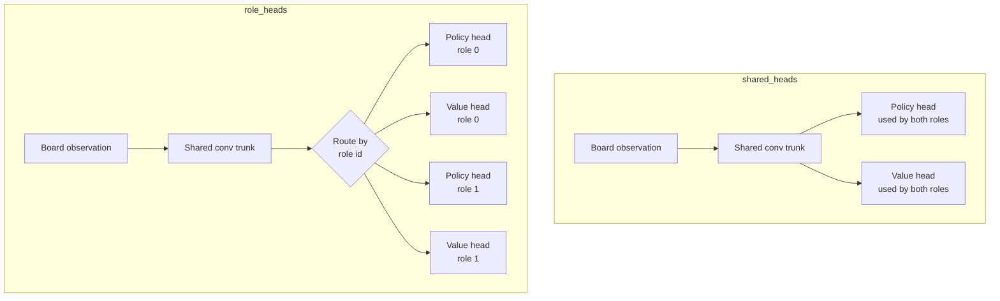

# Professor Meeting Brief

Date: 2026-07-09
Project branch: `research/asymbench`

## One-Sentence Version

We have built an early prototype of **AsymBench**: a generator for small
asymmetric board games, plus an evaluation pipeline that tests whether learning
agents behave differently across game families, role structures, and generated
instances.

The important result so far is not "role-head networks are better." The more
interesting result is:

> Generated asymmetric games can expose where evaluator conclusions are stable,
> unstable, family-specific, or seed-dependent.

That is the research story worth discussing.

## What We Have Built

We now have a working research pipeline with four main parts.

1. **Game generators**

   We can generate many small asymmetric grid games from controlled families.
   Each generated game is saved as a structured spec: board size, roles, pieces,
   action rules, terminal rules, and seed.

2. **Game validators**

   Generated games are checked so they are playable, non-trivial, and not broken
   immediately. We also run random/MCTS-style checks to label games by behavior.

3. **Stratification**

   Instead of treating all generated games as one pile, we sort them into
   behavioral buckets:

   - `clean`: relatively normal control games.
   - `role_inversion`: games where role advantage behaves unexpectedly.
   - `collapse`: games where one side's strategic options collapse under search.
   - `seat_sensitive`: games where first-player/seat effects matter.
   - `horizon_stress`: games affected by long-horizon/draw pressure.

4. **RL evaluator**

   We run a small AlphaZero-like learner on selected games and compare two neural
   architectures:

   - `shared_heads`: one shared policy/value output for all roles.
   - `role_heads`: separate policy/value outputs depending on the role.

   In plain terms: we are testing whether an agent benefits from having
   role-specific decision machinery in asymmetric games.

The whole pipeline as one picture:



## How The Games Work

Right now we have two generated game families.

## Family 1: Escape-Capture

This is the most important family in the current results.

There are two roles:

- **Attacker**
- **Defender**

The board contains:

- attackers,
- guards,
- one key piece,
- exit squares,
- sometimes hostile/capturing squares.

The defender controls the key and guards. The attacker's goal is to capture the
key. The defender's goal is to move the key to an exit.

Pieces move one square orthogonally. The key is captured if it is trapped from
opposite sides, similar to tafl-like capture logic. If the key reaches an exit,
the defender wins. If the key is captured, the attacker wins. If the maximum
ply limit is reached, the game can end in a draw or timeout-style result.

An illustrative sketch (not a specific generated instance):

```text
. . E . .     E = exit square
. G K G .     K = key        (defender wins if K reaches an E)
. . G . .     G = guard      (defender piece)
A . . . A     A = attacker   (attacker wins by trapping K)
A . . . A
```

Why this is useful:

Escape-capture games naturally create asymmetric objectives. One side is trying
to escape with a valuable piece; the other is trying to surround and capture it.
That gives us role asymmetry, draw pressure, and many ways for generated games
to become easier or harder for one side.

## Family 2: Connection-Disruption

There are two roles:

- **Builder**
- **Breaker**

The builder tries to create a connected path from the west edge to the east
edge of the board.

The breaker tries to stop this. Depending on the generated game, the breaker may
move blockers and remove builder pieces by adjacency, range, or line-based
removal.

The board can also contain protected cells, which behave like blocked terrain.

An illustrative sketch (not a specific generated instance):

```text
W . B B . E     W/E = west and east edges the builder must connect
W B B . . E     B   = builder marker
W . . d . E     d   = breaker disruptor (blocks or removes markers)
W . # . . E     #   = protected cell, behaves like blocked terrain
```

Why this is useful:

Connection-disruption games give us a different kind of asymmetry. One role is
constructive: make a path. The other is destructive: block or remove parts of
that path. This is quite different from escape-capture, so it helps test whether
an evaluator result is general or family-specific.

## Background: What AlphaZero-Lite Is

AlphaZero (DeepMind, 2017) is a system that learns board games from scratch
through self-play. It is given only the rules, no human game data. It combines
two parts that improve each other:

1. **A neural network** that looks at a board position and outputs a *policy*
   ("which moves look promising here") and a *value* ("who is probably
   winning").

2. **Monte Carlo Tree Search (MCTS)**, a look-ahead search that simulates
   possible continuations before each move. The network's policy tells the
   search which branches are worth exploring; the network's value judges
   positions without playing them out to the end.

The training loop is self-play: the agent plays games against itself using
MCTS at every move, then the network is trained on those games. The policy
head learns to predict what the search concluded (search is smarter than the
raw network, so it is a useful teacher), and the value head learns to predict
who actually won. The improved network makes the search stronger, which
produces better training games, and so on.



Our version is "lite" because every knob is shrunk: the network is two conv
layers plus one small dense layer (`research/asymbench/learning/model.py`),
the search is a compact PUCT-style MCTS with a small simulation budget
(`research/asymbench/search/mcts.py`), and training is plain Adam on a single
GPU. Real AlphaZero used dozens of residual blocks and thousands of TPUs.

The smallness is deliberate, not a compromise. The point is a tractable
GPU-local evaluator that can be retrained many times, so we can ask "does this
conclusion survive 8 seeds and 4 generated games?" on an RTX 4080. AlphaZero-
lite is the measurement instrument in AsymBench, not the product.

## Background: What "Role Heads" Means

In neural network jargon, a *head* is a final output layer. An AlphaZero-style
network has two: a policy head and a value head. The experiment compares two
ways of wiring them:

- `shared_heads`: one policy head and one value head, used no matter which
  role the agent is playing. Both roles' strategies must share the same
  output weights.

- `role_heads`: the same shared trunk (the layers that read the board), but a
  separate policy head and value head per role. When the agent moves as
  attacker, its features go through the attacker's heads; as defender,
  through the defender's heads.



The intuition being tested: in an asymmetric game, "escape with the key" and
"trap the key" are such different objectives that forcing one output layer to
serve both might hurt. Role heads give each side its own decision machinery.
In the code this is a single boolean flag on `PolicyValueNet`; everything else
(trunk size, compute, seeds, MCTS budget) is held identical, so any measured
difference is attributable to role conditioning.

## Background: Why We Chose The Role-Head Probe

This choice has a paper trail worth remembering in the meeting.

1. **Two nearby papers closed off the obvious angles.** RuleSmith covers LLM
   balancing of an asymmetric game and MeepleLM covers virtual playtesting
   (see `ASYMBENCH_NOVELTY_RESEARCH_2026-07-03.md`). What survived was the
   gap neither touches: generate asymmetric games and measure how agents
   learn and misunderstand the two roles.

2. **We needed an evaluator manipulation that maps one-to-one to asymmetry.**
   Shared heads versus role heads is the minimal contrast: same trunk, same
   compute, same everything except role-specific output layers. Any delta is
   about asymmetry itself.

3. **There was a prior-art hook.** An AlphaZero-on-Tablut result showed
   role-specific heads on a highly asymmetric historical game, including
   instability and role forgetting. So the effect was known to exist; the
   question was whether it appears in small generated games.

4. **It is tractable.** A run takes hours on the RTX 4080, which is what
   makes the seed- and strata-level robustness analysis affordable at all.

5. **It was always framed as a probe, not the contribution.** The novelty
   deep dive explicitly lists "role heads are novel" and "role heads are
   generally better" as unsafe claims, and defines the metric as
   architecture *sensitivity*. The probe's job was to demonstrate that the
   benchmark can detect evaluator-dependent conclusions, and that is exactly
   what happened.

## What We Have Actually Tested

We started with small smoke tests, then moved into larger GPU runs on the RTX
4080.

The main experiment sequence was:

1. **Manifest-based pilot**

   We built tooling that selects games from benchmark manifests and creates
   reproducible RL configs.

2. **Targeted role-head scale-up**

   We ran 12 configs across:

   ```text
   clean
   role_inversion
   collapse
   ```

   This took about 6.8 hours.

   Important outcome:

   The early/simple story changed. Role-head performance was not globally
   better or worse. The effect depended on the bucket and family.

3. **Stability probe**

   We then focused on four important cells:

   ```text
   role_inversion::connection_disruption
   collapse::connection_disruption
   collapse::escape_capture
   clean::connection_disruption
   ```

   This ran 8 configs with 8 training seeds each and took about 9.5 hours.

   Important outcome:

   `collapse::escape_capture` was the strongest role-head-positive cell, but
   the other cells had weaker or unstable signals.

4. **Escape-collapse deepening probe**

   We expanded `collapse::escape_capture` from 2 generated games to 4 generated
   games and used 8 training seeds per game.

   This took about 3.2 hours.

   Result:

   ```text
   role-head pooled seed delta = +0.0577
   CI95 = [-0.0048, +0.1242]
   positive seed deltas = 18
   negative seed deltas = 8
   zero seed deltas = 6
   ```

   ```mermaid
   pie showData
       title Seed deltas in collapse::escape_capture, role_heads minus shared_heads
       "positive" : 18
       "negative" : 8
       "zero" : 6
   ```

   Plain interpretation:

   Role heads still look better on average in this cell, but the confidence
   interval now barely crosses zero. So the effect is promising, but not yet a
   clean final claim.

## Where We Stand Scientifically

The current evidence does **not** support a simple claim like:

> Role-head AlphaZero is better for asymmetric games.

That would be too strong.

The evidence does support a more interesting claim:

> AsymBench can generate asymmetric game families and identify specific strata
> where evaluator conclusions are stable, unstable, or instance-dependent.

This is better as a research contribution because it is about benchmark design,
not just one architecture result.

## Why This Might Be Novel

The nearby work we discussed is mostly about:

- using LLMs to balance or generate games,
- using virtual playtesters,
- evaluating agents on existing games,
- or running broad game-playing benchmarks.

Our angle is different:

> We are generating asymmetric game instances, labeling them by behavioral
> stratum, and using tractable RL experiments to see where evaluation claims
> survive across seeds and generated instances.

The novelty is not only "we generated games." The novelty is the full loop:

1. Generate asymmetric games.
2. Validate that they are playable.
3. Label them into meaningful behavioral strata.
4. Run controlled evaluator comparisons.
5. Test whether conclusions survive more seeds and more generated instances.

This gives us a way to study evaluator robustness, not just agent strength.

## What The Professor Should Know

The project is currently at the prototype-plus-early-evidence stage.

We have:

- a working generator for two asymmetric grid-game families,
- a manifest system for selecting reproducible benchmark subsets,
- role/seat-aware game state representations,
- AlphaZero-lite training/evaluation,
- seed-level stability summaries,
- several long GPU runs,
- and a concrete empirical pattern worth discussing.

We do not yet have:

- a polished benchmark package,
- LLM-agent evaluations,
- human experiments,
- statistical power enough for a strong architecture claim,
- or a final paper framing.

## The Main Decision Point

The key question for tomorrow is probably:

> Should the paper be framed around role-head architecture, or around
> stratified evaluator stress testing?

Based on the evidence, the second framing is stronger.

The role-head result is useful because it gives us a concrete example of an
architecture-sensitive effect, but the bigger contribution is that AsymBench can
show when that effect is stable or unstable.

## Suggested Meeting Talking Points

1. We have moved from a broad idea to a working experimental loop.

2. The most interesting thing is that generated asymmetric games are not
   interchangeable. Family, stratum, instance, draw rate, and seed all matter.

3. The `collapse::escape_capture` cell is currently the best positive example:
   role heads do better on average, but the effect weakens when we add more
   generated games.

4. This suggests the benchmark should be used to study evaluator robustness,
   not just to declare a winning agent.

5. The natural next step is to make paper-facing analysis tables/plots and then
   add a small LLM-agent evaluation on selected exemplar games.

## A Likely Question: LLMs Have No Role Heads, So What Then?

If the professor asks this, it is the right question, and the answer supports
the second framing.

The role-head comparison does not transfer to LLM agents. An LLM has no
policy/value heads to split per role, so the architecture delta is a
measurement that only exists for the RL evaluator. But it was never supposed
to transfer:

- The strata (`clean`, `role_inversion`, `collapse`, ...) are properties of
  the *games*, defined by random/MCTS behavior. No neural architecture is
  involved in their definition.

- Role bias, seat bias, per-role win rates, and evaluator disagreement are
  defined over *any* agent that can play the game. An LLM slots into the
  evaluator set exactly like MCTS did.

- The underlying question was never "do separate linear layers help." It was
  "does role-conditioned decision machinery matter in asymmetric games?" For
  an RL network the conditioning knob is architecture. For an LLM the
  conditioning knob is the prompt.

| | RL evaluator | LLM evaluator |
| --- | --- | --- |
| Role conditioning knob | network heads | prompt |
| Controlled comparison | `shared_heads` vs `role_heads` | generic prompt vs role-specific prompt |
| Everything held fixed | trunk, compute, seeds, MCTS budget | model, rules text, board encoding |
| Sensitivity metric | architecture delta | prompting delta (same definition) |

So the LLM analogue of the role-head experiment is role-conditioned
prompting: a generic "here are the rules, pick a legal move" prompt versus a
role-framed prompt that foregrounds that role's objective. Same experimental
shape, different conditioning knob.

This is also an argument for the framing decision above. A paper framed
around role-head architecture would not connect to the LLM chapter at all.
A paper framed around stratified evaluator stress testing treats the
role-head result as completed case study one and the LLM as case study two:

- If LLM failures line up with the same strata, that validates the strata as
  real game properties.

- If LLMs fail in different places, that shows evaluator conclusions are
  agent-class-dependent, which is arguably an even better result for the
  benchmark story.

## Suggested Next Experiment

The next experiment should be small and illustrative, not another huge sweep.

Use a small set of selected exemplars:

```text
positive escape-collapse exemplar: seed 5160 or 5115
neutral escape-collapse exemplar: seed 5121
high-variance escape-collapse exemplar: seed 5051
control connection-disruption exemplar: seed 8003 or 9109
```

Then compare:

```text
random baseline
MCTS baseline
shared-head AlphaZero-lite
role-head AlphaZero-lite
LLM agent with legal-action prompting
```

The research question would be:

> Do LLM agents show the same stratum/instance sensitivity as the RL agents, or
> do they fail in a different way?

That connects directly to the larger goal of evaluating LLM agents and humans on
generated asymmetric games.

## Short Version To Say Out Loud

"We built a prototype benchmark generator for asymmetric grid games. Right now
it has two families: one where a defender tries to escape with a key while an
attacker tries to capture it, and one where a builder tries to make a connection
while a breaker disrupts it. We then ran AlphaZero-lite comparisons between a
shared-head architecture and a role-head architecture. The early result is not
that one architecture always wins. The more interesting result is that generated
games can be stratified into cells where evaluator conclusions are stable,
unstable, or instance-dependent. The strongest current example is
`collapse::escape_capture`, where role heads are positive on average but the
effect weakens after adding more generated games. So I think the paper should be
framed around AsymBench as a generator-based stress test for evaluator
robustness in asymmetric games."
